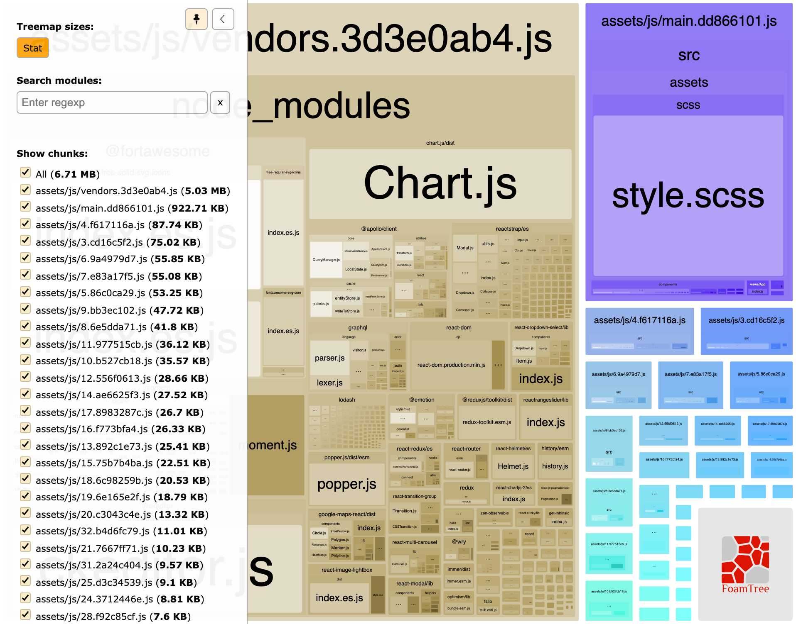

# Webpack Bundle Comparator

## Тестовое задание

1. Сделать копию репозитория
2. Собрать проект и статистику по бандлам
3. Провести анализ бандлов
4. Сделать issue в [репозиторий](https://github.com/AleynikovSergey/webpack-bundle-comparator), в котором будет лежать скрин странички с анализом бандлов тестового проекта, и написать пару предложений чем заинтересовал проект

Пример анализа: 
